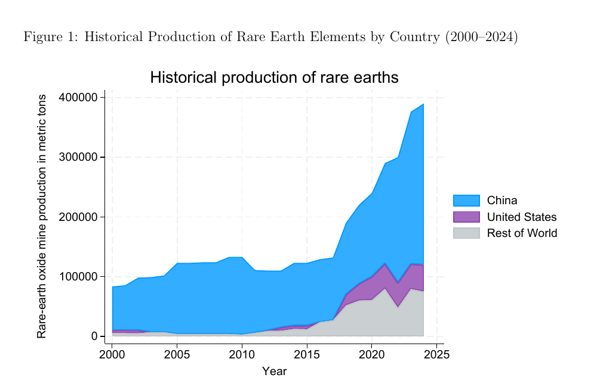
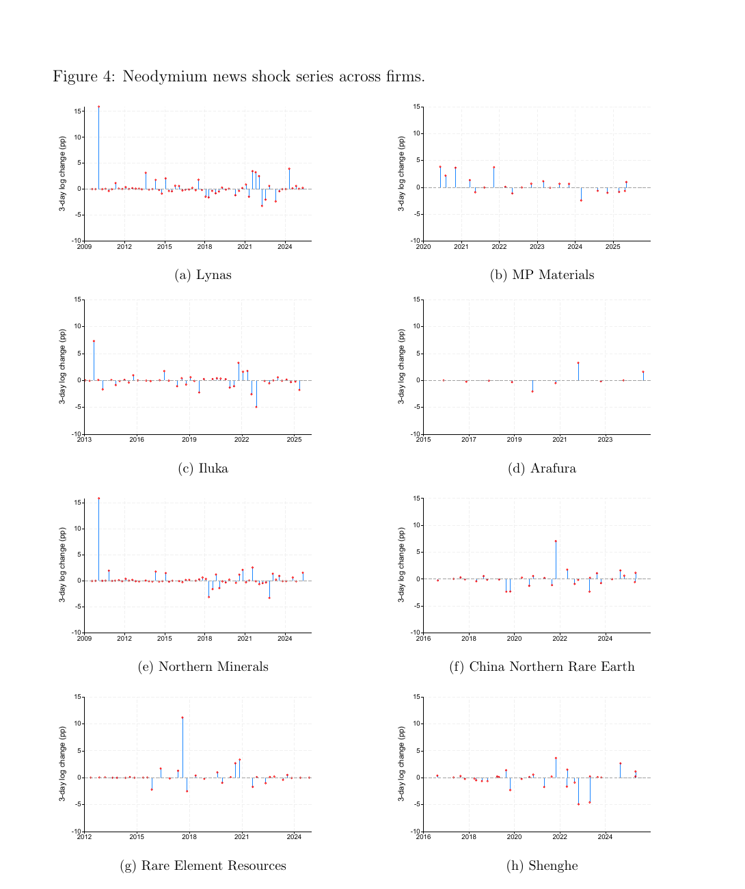
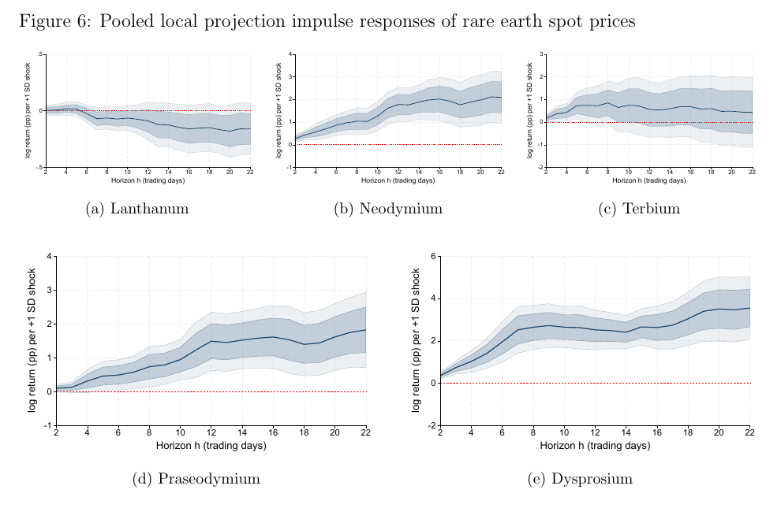
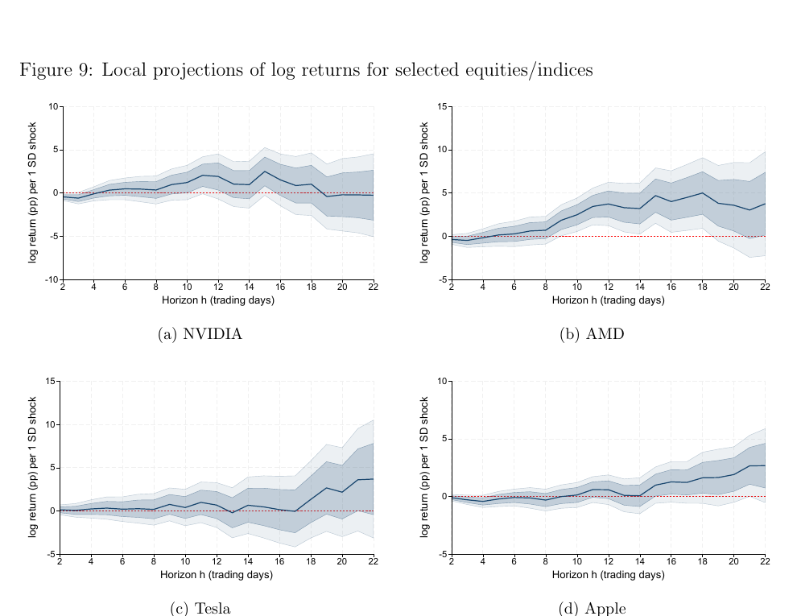

# Rare Earth Elements Supply and Financial Markets

## Evidence from High-Frequency Analysis

**How are firm-level supply disclosures reflected in rare-earth spot prices, and do these shocks spill over to broader financial markets?**

Rare earth elements (REEs) are critical inputs in clean-energy technologies, electronics, defence, and advanced manufacturing, but their spot markets are thin, opaque, and highly concentrated. This thesis constructs a new calendar-dated event database from disclosures by eight major listed producers, aligns those events with daily prices for five rare-earth oxides, and builds a firm-metal news shock series for high-frequency analysis.

**Firm disclosures move some rare-earth price levels, but not volatility systematically.** Event windows have flatter distributions and heavier tails than strict no-news windows, yet pooled Brown-Forsythe tests do not reject equal variances for any of the five metals (*p* = 0.112-0.625).

**The response is gradual and metal-specific.** Local projections show cumulative increases of roughly 2 percentage points for neodymium and praseodymium and 3-4 percentage points for dysprosium by 22 trading days. Lanthanum and terbium show no robust response.

**The effects do not propagate measurably to broader equities.** Neither major equity indices nor selected rare-earth-intensive firms - including NVIDIA, AMD, Tesla, Apple, and BYD - show statistically significant or persistent reactions.

The patterns are robust to calendar-matched control windows, the exclusion of high-geopolitical-risk days, and an extension of the projection horizon to approximately five months. Because the shock measure is constructed from observed spot-price returns rather than an external instrument, the estimates are descriptive event-time associations, not causal effects.



*Global rare-earth mine production, 2000-2024. The figure highlights the concentration of production in China. Source data: USGS.*

---

## Findings at a glance

| Question | Evidence |
|---|---|
| Do disclosure windows have different return distributions? | Yes. They display flatter densities and heavier tails. |
| Does volatility rise systematically? | No. Pooled Brown-Forsythe *p*-values range from 0.112 to 0.625. |
| Which spot prices respond most clearly? | Neodymium, praseodymium, and dysprosium show modest but persistent cumulative increases. |
| Are the effects transitory? | The responding metals do not reverse within the 22-trading-day baseline horizon. |
| Do broad equity markets respond? | No statistically significant or persistent response is detected. |
| Do rare-earth-intensive firms respond? | No robust response is detected for NVIDIA, AMD, Tesla, Apple, or BYD. |

## The new event-time database

Events are official quarterly reports and market-sensitive press releases covering production changes, capacity expansions, operational disruptions, and material financial updates. Release dates are collected from investor-relations pages, regulatory filings, and established news sources.

The sample covers eight major producers:

- China Northern Rare Earth Group High-Tech
- Lynas Rare Earths
- MP Materials
- Shenghe Resources Holding
- Iluka Resources
- Rare Element Resources
- Arafura Rare Earths
- Northern Minerals

Together, these firms represented more than half of sector market capitalisation in mid-2025.



*Neodymium news shocks by firm. Each non-zero observation combines a dated disclosure with the corresponding three-day event-window return.*

## Empirical design

- **Event window.** A symmetric three-trading-day interval `[t-1, t, t+1]` around each disclosure captures possible information leakage, after-market releases, and slow price discovery.
- **News shock series.** For every firm and metal, the event-window log return is assigned to the disclosure date and the series is set to zero on non-event days.
- **Distributional evidence.** Kernel densities compare disclosure windows with strict no-news windows.
- **Variance evidence.** Median-centred Brown-Forsythe tests assess whether event-window dispersion differs from the control sample.
- **Dynamic responses.** Local projections estimate cumulative responses over 2-22 trading days using 12 lags and Newey-West HAC confidence intervals.
- **Robustness.** The analysis uses calendar-matched controls, removes elevated geopolitical-risk days, isolates low-substitution metals, separates institutional phases, and extends the horizon to roughly five months.



*Cumulative spot-price responses to a one-standard-deviation pooled firm-news shock. Dark and light bands denote 68% and 90% confidence intervals.*

## Financial-market results

The same shock series is applied to the S&P 500, Dow Jones, Nasdaq 100, MSCI World, and selected firms with high rare-earth exposure. The estimates remain small at impact and confidence intervals generally include zero throughout the horizon. AMD shows a temporary mid-horizon increase, but it is neither persistent nor robust across confidence bands.



*Cumulative return responses for NVIDIA, AMD, Tesla, and Apple. The estimates provide no robust evidence of economically meaningful spillovers.*

## Data

| Component | Source |
|---|---|
| Rare-earth oxide spot prices | Shanghai Metals Market via LSEG Datastream |
| Firm disclosures | Investor-relations pages, regulatory filings, and established financial news sources |
| Market and firm returns | LSEG Datastream |
| Historical production | United States Geological Survey |
| Geopolitical-risk controls | Caldara-Iacoviello Geopolitical Risk Index |

The spot-price sample begins in July 2009 and contains dysprosium, lanthanum, neodymium, praseodymium, and terbium. The underlying commercial price and market data cannot be redistributed publicly. This repository therefore provides the paper and selected figures; a public replication package would require suitable data-access arrangements.

## Repository

```text
figures/    selected figures displayed in this README
paper/      full master's thesis as a PDF
README.md   research overview, findings, and methodology
CITATION.bib ready-to-use BibTeX citation
```

## Paper

[`paper/Philip_Kroos_Rare_Earth_Elements_Supply_and_Financial_Markets.pdf`](paper/Philip_Kroos_Rare_Earth_Elements_Supply_and_Financial_Markets.pdf)

Master's thesis, Department of Economics, University of Mannheim, October 2025.

## Citation

```bibtex
@mastersthesis{kroos2025rareearth,
  author = {Kroos, Philip},
  title  = {Rare Earth Elements Supply and Financial Markets: Evidence from High-Frequency Analysis},
  school = {University of Mannheim},
  year   = {2025},
  month  = {October}
}
```

The same entry is available in [`CITATION.bib`](CITATION.bib).

## Rights

Copyright © 2025 Philip Kroos. The paper and figures are provided for scholarly reading and citation. No licence is granted for redistribution of third-party or commercially sourced data.
